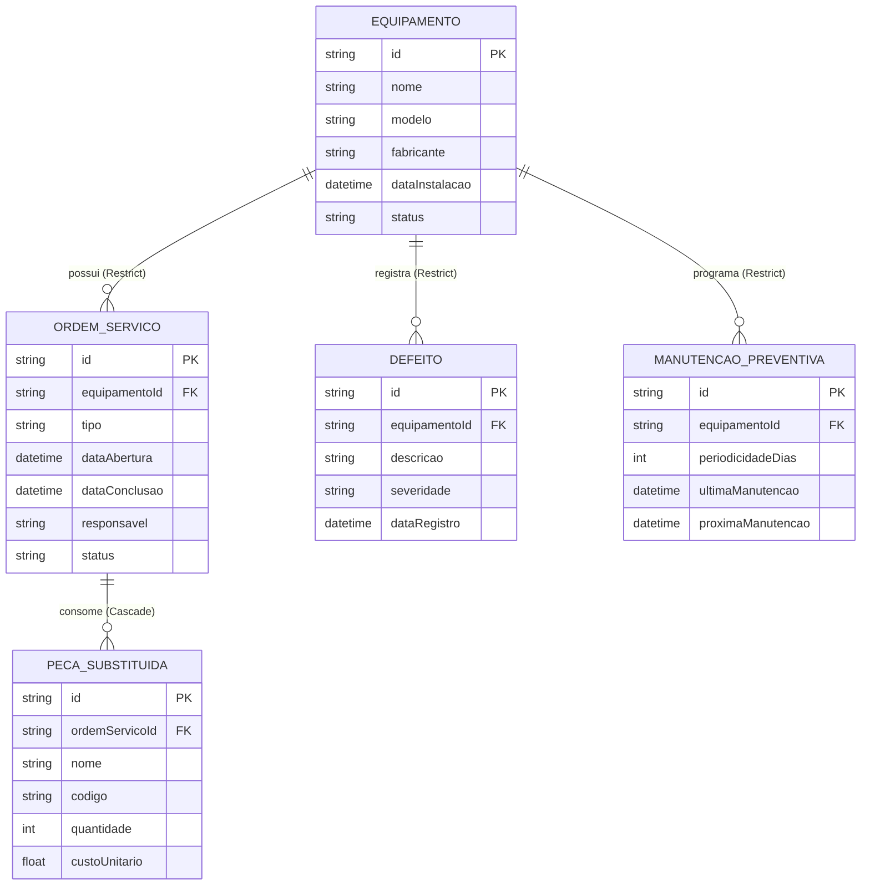

# 🏭 API de Controle de Manutenção Industrial

> **Projeto NP1 – Prova Subjetiva / Trabalho Prático em Equipe**  
> **Disciplina:** Desenvolvimento Web Back-End  
> **Instituição:** Centro Universitário Ateneu (UniATENEU) – Curso de Engenharia de Software  

---

## 📌 1. Visão Geral do Projeto

A **API de Controle de Manutenção Industrial** foi desenvolvida para substituir controles manuais em planilhas por uma solução RESTful moderna, altamente disponível e auditável. O sistema centraliza a gestão de ativos industriais, ordens de serviço (corretivas e preventivas), rastreabilidade de defeitos, cronogramas de manutenção e substituição de peças sobressalentes com controle de custos.

---

## 🏗️ 2. Arquitetura e Decisões de Engenharia

O projeto foi construído sob os preceitos de **Clean Architecture** e princípios **SOLID**:

* **Independência e Baixo Acoplamento:** Camadas organizadas de forma modular (Controllers, Middlewares, Routes, Config e Database).
* **Singleton Pattern:** Instância única e segura do `PrismaClient` em `src/config/prisma.ts`.
* **Tratamento Centralizado de Erros (DevSecOps):** Middleware `errorHandler` que intercepta exceções corporativas (`AppError`) e erros de integridade referencial do banco de dados, blindando o servidor contra falhas silenciosas ou vazamento de stacktraces sensíveis.
* **Persistência Confiável:** Modelagem relacional com **Prisma ORM** e banco **SQLite** (`dev.db`), garantindo integridade referencial (`Restrict` e `Cascade`), portabilidade e facilidade de demonstração.
* **Documentação Viva (OpenAPI 3.0):** Interface interativa via **Swagger UI** disponível em `/api-docs`.

---

## 🛠️ 3. Mapeamento e Resolução dos 8 Problemas Obrigatórios

| Problema | Cenário Avaliado | Solução Técnica Implementada | Método & Rota | Código HTTP |
| :--- | :--- | :--- | :--- | :--- |
| **Problema 1** | Máquina cadastrada com dados incorretos | Atualização cirúrgica de campos com validação de existência do ativo | `PUT /equipamentos/:id` | `200 OK` (ou `404`) |
| **Problema 2** | Tentativa de abrir OS para máquina inexistente | Validação prévia de existência da Foreign Key antes do insert | `POST /ordens-servico` | `404 Not Found` (bloqueio seguro) |
| **Problema 3** | Manutenção preventiva vencida | Filtro de query `proximaManutencao < hoje`, cálculo dinâmico de dias de atraso e alerta operacional | `GET /manutencoes/vencidas` | `200 OK` com flag `statusAlerta` |
| **Problema 4** | Consulta de histórico de peça substituída por código | Busca agregada com histórico de trocas, ordens de serviço, máquinas afetadas e custo acumulado | `GET /pecas/historico/:codigo` | `200 OK` com métricas consolidadas |
| **Problema 5** | Destaque de prioridade para defeito crítico | Classificação por severidade: defeitos `Crítico` ou `Alto` disparam flag de emergência e rota exclusiva | `POST /defeitos` e `GET /defeitos/criticos` | `201 Created` (`PRIORIDADE_MAXIMA`) |
| **Problema 6** | Tentativa de excluir máquina com OS vinculadas | Integridade referencial com cláusula `onDelete: Restrict` no Prisma; middleware intercepta e nega | `DELETE /equipamentos/:id` | `400 Bad Request` amigável |
| **Problema 7** | Listagem de máquinas atualmente em manutenção | Endpoint dedicado que filtra ativos com `status: 'Em manutenção'` e anexa ordens ativas | `GET /equipamentos/em-manutencao` | `200 OK` |
| **Problema 8** | Cálculo do custo total de peças em uma OS | Agregação monetária dinâmica: $\sum (\text{quantidade} \times \text{custoUnitario})$ com retorno formatado em BRL | `GET /ordens-servico/:id/custo-pecas` | `200 OK` com subtotal e total |

---

## 📊 4. Diagrama Entidade-Relacionamento (ERD)



---

## 🚀 5. Como Executar o Projeto Passo a Passo

### Pré-requisitos
* **Node.js** (v18 ou superior)
* **npm** (v9 ou superior)
* **Git** instalado

### Passo 1: Clonar o Repositório
```bash
git clone https://github.com/ScriptDev/API-de-Manuten-o-Industrial.git
cd API-de-Manuten-o-Industrial
```

### Passo 2: Instalar as Dependências
```bash
npm install
```

### Passo 3: Sincronizar o Banco de Dados (SQLite)
```bash
npx prisma db push
```

### Passo 4: Popular o Banco de Dados com Dados de Teste (Seed)
Executa a carga automática de cenários reais para a apresentação:
```bash
npm run seed
```

### Passo 5: Iniciar o Servidor em Modo Desenvolvimento
```bash
npm run dev
```

O servidor iniciará em:  
👉 **API Local:** `http://localhost:3000`  
👉 **Swagger UI:** `http://localhost:3000/api-docs`

---

## 🧪 6. Testes via Postman

1. Abra o **Postman**.
2. Clique no botão **Import** (canto superior esquerdo).
3. Selecione o arquivo `postman_collection.json` presente na raiz do projeto.
4. A coleção **"NP1 - Manutenção Industrial (API Completa)"** será carregada com todas as rotas divididas em 5 módulos e os testes com validações de erro já configurados.

---

## 📁 7. Estrutura do Código-Fonte

```text
├── prisma/
│   └── schema.prisma            # Definição das entidades e integridade referencial
├── src/
│   ├── config/
│   │   ├── prisma.ts            # Singleton do cliente Prisma
│   │   └── swagger.ts           # Definição completa da especificação OpenAPI 3.0
│   ├── controllers/
│   │   ├── EquipamentoController.ts
│   │   ├── OrdemServicoController.ts
│   │   ├── DefeitoController.ts
│   │   ├── ManutencaoController.ts
│   │   └── PecaController.ts
│   ├── errors/
│   │   └── AppError.ts          # Exceção personalizada com status HTTP
│   ├── middlewares/
│   │   └── errorHandler.ts      # Interceptador global e saneador de erros
│   ├── routes/
│   │   ├── equipamento.routes.ts
│   │   ├── ordemServico.routes.ts
│   │   ├── defeito.routes.ts
│   │   ├── manutencao.routes.ts
│   │   ├── peca.routes.ts
│   │   └── index.ts             # Agrupador central de rotas
│   ├── app.ts                   # Configuração dos middlewares Express e Swagger
│   ├── server.ts                # Inicialização do servidor HTTP
│   └── seed.ts                  # Carga inicial automatizada para a demonstração
├── postman_collection.json      # Coleção completa exportada para o Postman
├── package.json
├── tsconfig.json
└── README.md
```

---

Ass: Samuel Mendes Cardoso - Software Factory Labs
