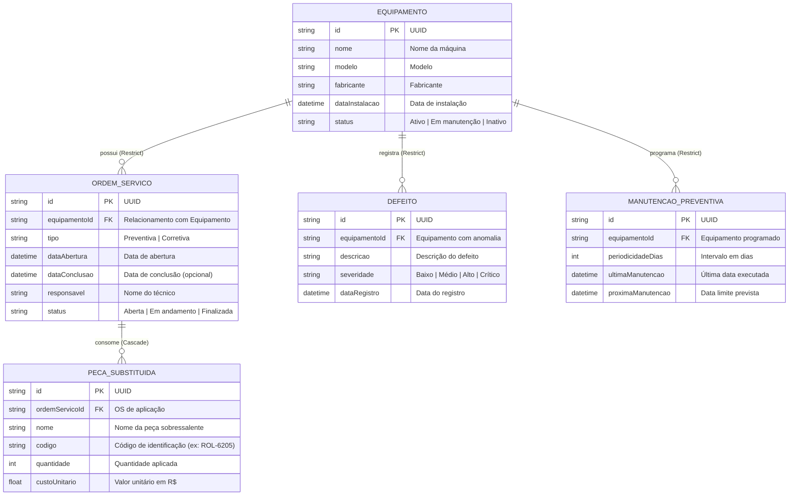

# 🏭 API de Controle de Manutenção Industrial

> **Projeto NP1 – Prova Subjetiva / Trabalho Prático em Equipe**  
> **Disciplina:** Desenvolvimento Web Back-End  
> **Instituição:** Centro Universitário Ateneu (UniATENEU) – Curso de Engenharia de Software  
> **Repositório Oficial:** [https://github.com/ScriptDev/API-de-Manuten-o-Industrial.git](https://github.com/ScriptDev/API-de-Manuten-o-Industrial.git)  

---

## 📌 1. Visão Geral do Projeto

A **API de Controle de Manutenção Industrial** foi desenvolvida para solucionar o problema crítico de indústrias que operam com registros de manutenção dispersos em planilhas eletrônicas. O sistema centraliza a governança de ativos fabris em uma arquitetura RESTful de alta performance, assegurando persistência íntegra, rastreabilidade de falhas, planejamento preventivo de paradas e controle orçamentário do consumo de peças.

A solução cumpre **100% dos requisitos do edital da NP1**, incluindo todas as operações CRUD obrigatórias, tratamento defensivo de erros, documentação interativa OpenAPI/Swagger, testes automatizados no Postman e resolução dos **8 cenários práticos** propostos.

---

## 🗺️ 2. Onde Fica a Documentação da API?

A documentação está distribuída de forma profissional em três níveis complementares:

1. **Documentação Interativa (Swagger / OpenAPI 3.0):**  
   Disponível em tempo de execução no navegador no endpoint:  
   👉 `http://localhost:3000/api-docs`  
   Permite testar qualquer rota em tempo real com o botão *Try it out*, schemas validados e exemplos de payload.
2. **Documentação Técnica Estrutural (Este arquivo README.md):**  
   Visível diretamente no GitHub e na raiz do projeto, contendo arquitetura, diagramas ERD, dicionário de rotas com entradas/saídas e guia de apresentação.
3. **Documentação de Testes Executáveis (Postman Collection):**  
   Arquivo [`postman_collection.json`](./postman_collection.json) pronto para ser importado no Postman, contendo todas as requisições categorizadas por módulo e testes para os 8 problemas.
4. **Manual Passo a Passo de Testes:**  
   Consulte o guia dedicado [`COMO_TESTAR.md`](./COMO_TESTAR.md) para instruções detalhadas de teste via Swagger, Postman e validação dos 8 problemas.

---

## 🏗️ 3. Arquitetura e Engenharia de Software (Clean Architecture & SOLID)

O projeto adota a separação rigorosa de preocupações inspirada em **Clean Architecture**:

* **Independência de Frameworks:** Os domínios e regras de negócio não dependem do Express ou do banco de dados para serem testados.
* **Singleton Pattern:** Instância única e gerenciada do `PrismaClient` em `src/config/prisma.ts`.
* **Centralized Error Handling (DevSecOps):** Middleware global `errorHandler` intercepta exceções corporativas (`AppError`) e códigos de restrição do Prisma (`P2003` para Foreign Key Restrict e `P2025` para Not Found), devolvendo payloads JSON padronizados e sem expor stacktraces internos.
* **Integridade Referencial:** Configuração estrita de chaves estrangeiras:
  * `Equipamento -> OrdemServico`: `onDelete: Restrict` (impede a deleção acidental de máquinas com histórico).
  * `OrdemServico -> PecaSubstituida`: `onDelete: Cascade` (exclusão de OS limpa peças a ela pertencentes).

---

## 📊 4. Diagrama Entidade-Relacionamento (ERD)



---

## 📚 5. Descritivo Detalhado dos Módulos e Endpoints

### 5.1. Módulo: Equipamentos
* **Finalidade:** Gestão do parque industrial e controle de ciclo de vida operacional.
* **Endpoints:**
  * `GET /equipamentos` – Lista todos os equipamentos cadastrados (suporta query `?status=Ativo`).
  * `GET /equipamentos/:id` – Retorna equipamento completo por ID com ordens, defeitos e manutenções anexados.
  * `POST /equipamentos` – Cadastra novo ativo fabril.
    * *Body:*
      ```json
      {
        "nome": "Torno CNC Multifuncional",
        "modelo": "Galaxy 30M",
        "fabricante": "Romi",
        "dataInstalacao": "2023-01-15T08:00:00Z",
        "status": "Ativo"
      }
      ```
    * *Resposta esperada:* `201 Created`
  * `PUT /equipamentos/:id` (**Problema 1**) – Atualiza dados cadastrados incorretamente.
    * *Body:* `{"nome": "Torno CNC Corrigido", "modelo": "Galaxy 30M EVO"}`
    * *Resposta esperada:* `200 OK`
  * `DELETE /equipamentos/:id` (**Problema 6**) – Remove equipamento se não houver vínculos. Se houver OS vinculada, devolve:
    * *Resposta esperada:* `400 Bad Request` com mensagem: `"Impossível excluir equipamento: Existem registros vinculados (...)."`
  * `GET /equipamentos/em-manutencao` (**Problema 7**) – Consulta máquinas com status `'Em manutenção'`.
    * *Resposta esperada:* `200 OK` com array de equipamentos e suas ordens de serviço ativas.

---

### 5.2. Módulo: Ordens de Serviço
* **Finalidade:** Controle de manutenções corretivas e preventivas, técnicos responsáveis e ciclo da OS.
* **Endpoints:**
  * `GET /ordens-servico` – Lista ordens (suporta filtros `?status=`, `?tipo=`, `?equipamentoId=`).
  * `GET /ordens-servico/:id` – Detalhes da OS, máquina associada e peças aplicadas.
  * `POST /ordens-servico` (**Problema 2**) – Criação de OS com validação estrita de FK.
    * *Body:*
      ```json
      {
        "equipamentoId": "UUID_DO_EQUIPAMENTO",
        "tipo": "Corretiva",
        "responsavel": "Carlos Alberto (Mecânico)",
        "status": "Aberta"
      }
      ```
    * *Resposta esperada:* `201 Created` (ou `404 Not Found` caso o equipamento informado não exista).
  * `PUT /ordens-servico/:id` – Atualiza status, responsável e data de conclusão.
    * *Regra de Negócio:* Se a OS já estiver `'Finalizada'`, rejeita a alteração com `400 Bad Request`.
  * `DELETE /ordens-servico/:id` – Remove OS (bloqueia exclusão de OS já finalizada por compliance).
  * `GET /ordens-servico/:id/custo-pecas` (**Problema 8**) – Calcula o custo consolidado de todas as peças utilizadas.
    * *Resposta esperada:* `200 OK`:
      ```json
      {
        "ordemServicoId": "uuid-da-os",
        "totalItensSubstituidos": 6,
        "custoTotal": 431.00,
        "custoTotalFormatado": "R$ 431,00",
        "pecas": [
          { "nome": "Rolamento Cônico", "quantidade": 2, "custoUnitario": 145.5, "subtotal": 291.0 },
          { "nome": "Retentor Viton", "quantidade": 4, "custoUnitario": 35.0, "subtotal": 140.0 }
        ]
      }
      ```

---

### 5.3. Módulo: Registro de Defeitos
* **Finalidade:** Registro de falhas com triagem de severidade e disparo de alertas operacionais.
* **Endpoints:**
  * `GET /defeitos` – Lista todos os defeitos.
  * `GET /defeitos/criticos` (**Problema 5**) – Filtra anomalias de severidade `'Crítico'` ou `'Alto'`.
  * `GET /defeitos/:id` – Consulta defeito por ID.
  * `POST /defeitos` (**Problema 5**) – Registra anomalia. Se severidade for `'Crítico'`, retorna flag de prioridade imediata.
    * *Body:*
      ```json
      {
        "equipamentoId": "UUID_DO_EQUIPAMENTO",
        "descricao": "Ruptura no manifold de pressão com vazamento de óleo aquecido.",
        "severidade": "Crítico"
      }
      ```
    * *Resposta esperada:* `201 Created`:
      ```json
      {
        "status": "PRIORIDADE_MAXIMA",
        "alertaPrioridade": "🚨 ATENÇÃO OPERACIONAL: Defeito com grau de severidade \"CRÍTICO\" registrado! Notificação enviada à equipe técnica...",
        "defeito": { ... }
      }
      ```
  * `PUT /defeitos/:id` – Atualiza descrição ou severidade.
  * `DELETE /defeitos/:id` – Exclui registro de defeito.

---

### 5.4. Módulo: Controle de Manutenção Preventiva
* **Finalidade:** Cronograma preventivo por periodicidade (dias) e emissão de alarmes de vencimento.
* **Endpoints:**
  * `GET /manutencoes` – Lista todas as programações.
  * `GET /manutencoes/vencidas` (**Problema 3**) – Identifica manutenções com data prevista no passado (`proximaManutencao < hoje`).
    * *Resposta esperada:* `200 OK`:
      ```json
      {
        "totalVencidas": 1,
        "statusAlerta": "ALERTA_ATIVO",
        "vencidas": [
          {
            "id": "uuid",
            "equipamento": { "nome": "Prensa Hidráulica 200T", "status": "Em manutenção" },
            "diasAtraso": 12,
            "alertaOperacional": "⚠️ ATENÇÃO: MANUTENÇÃO PREVENTIVA VENCIDA HÁ 12 DIA(S)! Risco de parada não programada."
          }
        ]
      }
      ```
  * `POST /manutencoes` – Cria programação. Se `proximaManutencao` não for informada, calcula dinamicamente com base em `ultimaManutencao + periodicidadeDias`.
  * `PUT /manutencoes/:id` – Atualiza intervalo ou datas.
  * `DELETE /manutencoes/:id` – Remove agendamento preventivo.

---

### 5.5. Módulo: Controle de Peças Substituídas
* **Finalidade:** Gestão de sobressalentes aplicados em ordens de serviço e histórico analítico de trocas.
* **Endpoints:**
  * `GET /pecas` – Lista todas as peças associadas a ordens de serviço.
  * `GET /pecas/:id` – Consulta peça por ID.
  * `POST /pecas` – Registra sobressalente em uma OS aberta.
    * *Regra de Negócio:* Rejeita adição em OS com status `'Finalizada'` (`400 Bad Request`).
  * `GET /pecas/historico/:codigo` (**Problema 4**) – Rastreia todas as substituições de um código específico de peça (ex: `ROL-6205`) ao longo do tempo.
    * *Resposta esperada:* `200 OK`:
      ```json
      {
        "codigoPeca": "ROL-6205",
        "nomeReferencia": "Rolamento de Precisão Cônico",
        "totalOcorrencias": 2,
        "quantidadeTotalConsumida": 6,
        "custoTotalAcumulado": 851.00,
        "custoTotalFormatado": "R$ 851,00",
        "historicoSubstituicoes": [ ... ]
      }
      ```
  * `PUT /pecas/:id` e `DELETE /pecas/:id` – Atualiza ou remove peças (bloqueado se a OS já estiver finalizada).

---

## 🎯 6. Resolução dos 8 Problemas Obrigatórios da NP1

| Nº | Problema do Enunciado | Resolução Técnica no Sistema | Endpoint Correspondente |
| :-: | :--- | :--- | :--- |
| **1** | **Máquina cadastrada incorretamente:** Como atualizar suas informações? | Endpoint `PUT` permite correção de qualquer atributo cadastral com integridade e validação de existência. | `PUT /equipamentos/:id` |
| **2** | **OS aberta para equipamento inexistente:** Como impedir esse cadastro? | Verificação no repositório se a Foreign Key existe. Caso não exista, o serviço bloqueia a inserção e emite erro `404 Not Found`. | `POST /ordens-servico` |
| **3** | **Manutenção preventiva vencida:** Como o sistema identificará? | Endpoint consulta registros onde `proximaManutencao < dataAtual`, calcula os dias de atraso e emite alerta operacional. | `GET /manutencoes/vencidas` |
| **4** | **Peça substituída diversas vezes no ano:** Como consultar o histórico? | Endpoint busca por código da peça (`/pecas/historico/:codigo`), agrega consumo total, custos e lista as máquinas e ordens envolvidas. | `GET /pecas/historico/:codigo` |
| **5** | **Defeito crítico registrado:** Como destacar sua prioridade? | Classificação do grau de severidade: se for `'Crítico'`, a resposta emite bandeira `PRIORIDADE_MAXIMA` e o defeito é exposto na rota de triagem urgente. | `POST /defeitos` e `GET /defeitos/criticos` |
| **6** | **Tenta excluir equipamento com OS vinculadas:** Como tratar esse caso? | O schema Prisma aplica `onDelete: Restrict`. O controller intercepta a violação e retorna `400 Bad Request` com mensagem explicativa ao usuário. | `DELETE /equipamentos/:id` |
| **7** | **Consultar máquinas atualmente em manutenção:** Como disponibilizar? | Endpoint dedicado que filtra máquinas com status `Em manutenção` e anexa ordens de serviço ativas. | `GET /equipamentos/em-manutencao` |
| **8** | **Calcular custo total de peças em uma OS:** Como calcular? | Rota de agregação que multiplica `quantidade × custoUnitario` para cada peça vinculada à OS e retorna os subtotais e o total em R$. | `GET /ordens-servico/:id/custo-pecas` |

---

## ⚙️ 7. Guia Passo a Passo: Dependências, Inicialização e Execução

### 7.1. Dependências do Projeto
* **Produção:**
  * `express` (^5.2.1) – Framework HTTP minimalista e robusto.
  * `@prisma/client` (^5.22.0) – ORM tipado para comunicação com banco de dados.
  * `cors` (^2.8.6) – Liberação de requisições Cross-Origin.
  * `swagger-ui-express` (^5.0.1) – Renderização da interface visual OpenAPI.
* **Desenvolvimento:**
  * `typescript` (^6.0.3) – Tipagem estática rigorosa.
  * `prisma` (^5.22.0) – CLI de migração e modelagem.
  * `ts-node-dev` (^2.0.0) – Execução em tempo de desenvolvimento com hot-reload.
  * `@types/node`, `@types/express`, `@types/cors`, `@types/swagger-ui-express`.

### 7.2. Comandos de Inicialização

1. **Instalar Dependências:**
   ```powershell
   npm install
   ```

2. **Gerar e Sincronizar o Banco SQLite:**
   Cria o arquivo `dev.db` com todas as tabelas e relacionamentos definidos no `prisma/schema.prisma`:
   ```powershell
   npx prisma db push
   ```

3. **Popular o Banco com Dados Reais para a Apresentação (Seed):**
   Insere máquinas em manutenção, ordens de serviço abertas e finalizadas, defeito crítico, manutenção vencida e peças com histórico compartilhado:
   ```powershell
   npm run seed
   ```

4. **Compilar o Projeto (Build):**
   Verifica e compila todo o código TypeScript para JavaScript na pasta `/dist`:
   ```powershell
   npm run build
   ```

5. **Iniciar a API em Desenvolvimento:**
   ```powershell
   npm run dev
   ```

   Acesse no navegador:
   * **API Root:** `http://localhost:3000`
   * **Swagger Interativo:** `http://localhost:3000/api-docs`

---

## 🎤 8. Roteiro Sugerido para a Apresentação de 15 Minutos

1. **Minutos 0 a 3 – Introdução e Arquitetura:**
   * Apresentar o problema (planilhas manuais na fábrica vs sistema integrado).
   * Mostrar a estrutura modular (`Clean Architecture`), o uso de TypeScript, Express e SQLite com Prisma ORM.
2. **Minutos 3 a 7 – Demonstração do Swagger e CRUD:**
   * Abrir `http://localhost:3000/api-docs`.
   * Demonstrar o cadastro de um equipamento, listagem e busca por ID.
3. **Minutos 7 a 12 – Apresentação dos 8 Problemas em Funcionamento (via Swagger ou Postman):**
   * **Problema 1:** Atualizar máquina com PUT.
   * **Problema 2:** Tentar abrir OS com ID inexistente e mostrar o erro 404 amigável.
   * **Problema 3:** Chamar `GET /manutencoes/vencidas` e mostrar o alerta operacional e dias de atraso.
   * **Problema 4:** Chamar `GET /pecas/historico/ROL-6205` e mostrar o histórico acumulado de substituições.
   * **Problema 5:** Chamar `GET /defeitos/criticos` e mostrar o alarme de emergência.
   * **Problema 6:** Tentar excluir uma máquina que possui OS e mostrar o bloqueio 400 por chave estrangeira.
   * **Problema 7:** Chamar `GET /equipamentos/em-manutencao`.
   * **Problema 8:** Chamar `GET /ordens-servico/:id/custo-pecas` e exibir o total somado das peças em reais.
4. **Minutos 12 a 15 – Conclusão e Testes no Postman:**
   * Abrir o Postman e mostrar a coleção `postman_collection.json` importada com todas as rotas verdes e funcionais.
   * Responder a perguntas do professor.

---

Ass: Samuel Mendes Cardoso - Software Factory Labs
